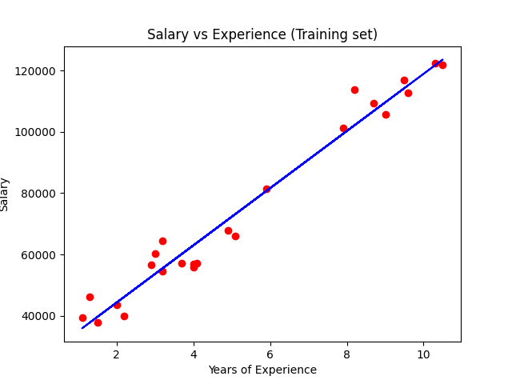
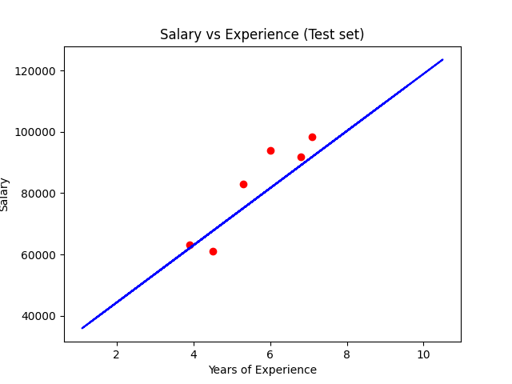

# Coding and Learning Exercises (Machine Learning A-Z: AI, Python & R)

## Table of Contents
1. [Description](#description)
2. [Setup](#setup)
3. [Usage](#usage)
4. [Project Structure](#project-structure)
5. [Dependencies](#dependencies)
6. [Commit Message Conventions](#commit-message-conventions)
7. [Models](#models)
   - [Simple Linear Regression](#simple-linear-regression)

## Description

This repository contains coding exercises from the Udemy course [Machine Learning A-Z: AI, Python & R](https://www.udemy.com/course/machinelearning). The project also leverages [Cursor](https://cursor.sh/) for code generation and project structuring.

## Setup

### Prerequisites

- Python 3.x
- pip

### Installation

1. **Clone the repository**:
   ```bash
   git clone git@github.com:chrischenyc/ml-a-z.git
   cd ml-a-z
   ```

2. **Install dependencies**:
   ```bash
   pip install -r requirements.txt
   ```

3. **Set up pre-commit hooks**:
   ```bash
   pre-commit install
   ```

## Usage

To automatically run and monitor changes in Python scripts, use `auto_run.py`. This script will keep running and watch for any modifications in the `src` folder. When a change is detected, the modified file will be re-executed automatically:
   ```bash
   python auto_run.py
   ```


## Project Structure

- `src/`: Contains all source code files.
- `data/`: Contains raw training data.
- `requirements.txt`: Lists Python dependencies.
- `.gitignore`: Specifies files and directories to be ignored by Git.
- `.pre-commit-config.yaml`: Contains configuration for pre-commit hooks.
- `.flake8`: Configuration file for flake8 linting.
- `pyproject.toml`: Configuration for commit message conventions.

## Dependencies

### Core Dependencies
- [Python 3.x](https://www.python.org/)
- [pip](https://pip.pypa.io/en/stable/)

### Machine Learning & Data Science
- [NumPy](https://github.com/numpy/numpy) - Numerical computing
- [pandas](https://github.com/pandas-dev/pandas) - Data manipulation and analysis
- [scikit-learn](https://github.com/scikit-learn/scikit-learn) - Machine learning algorithms
- [matplotlib](https://github.com/matplotlib/matplotlib) - Data visualization

### Development Tools
- [pre-commit](https://github.com/pre-commit/pre-commit) - Git hook management
- [flake8](https://github.com/PyCQA/flake8) - Python code linting
- [black](https://github.com/psf/black) - Python code formatting
- [isort](https://github.com/PyCQA/isort) - Import sorting
- [watchdog](https://github.com/gorakhargosh/watchdog) - File system events monitoring
- [colorama](https://github.com/tartley/colorama) - Cross-platform colored terminal text

### Git Tools
- [commitizen](https://github.com/commitizen-tools/commitizen) - Commit message conventions
- [questionary](https://github.com/tmbo/questionary) - Interactive command line prompts

## Commit Message Conventions

This project follows the [Conventional Commits](https://www.conventionalcommits.org/) specification. For detailed information about commit types and examples, please refer to:

- [Angular Commit Message Guidelines](https://github.com/angular/angular/blob/main/CONTRIBUTING.md#-commit-message-format)
- [Conventional Commits Specification](https://www.conventionalcommits.org/en/v1.0.0/)

The commit message format is enforced using [commitizen](https://github.com/commitizen-tools/commitizen).

## Models

### Simple Linear Regression
[src/s06/01_simple_linear_regression.py](src/s06/01_simple_linear_regression.py)



